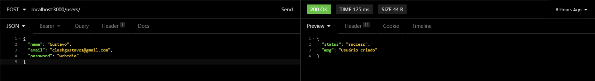
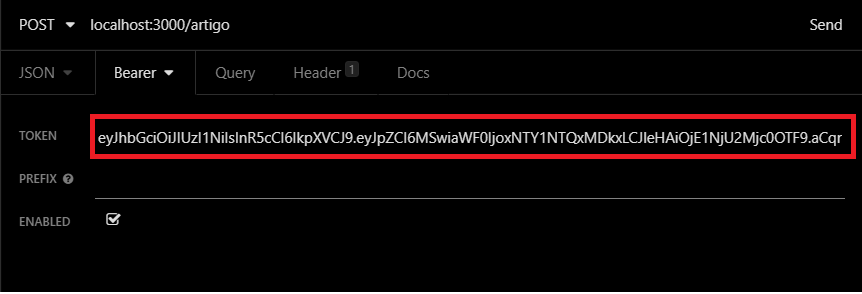
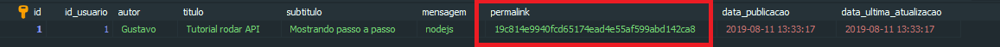
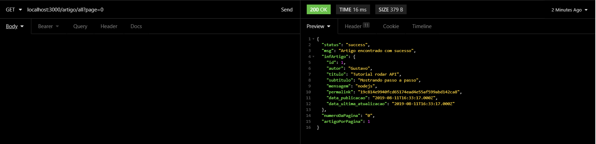

<h3 align="left">
    Português
</h3>

## :ballot_box_with_check: Para fazer

- TDD - Testes Unitários (jest) :heavy_check_mark:
- JWT (jsonwebtoken) :heavy_check_mark:
- Sistema de paginação :heavy_check_mark:

<h1 align="center">
    Como rodar a API
</h1>

## Requisitos

```
-Node - https://nodejs.org/en/
-Yarn ou npm - https://yarnpkg.com
-Insomnia ou postman - https://insomnia.rest
-Docker - https://www.docker.com/
-Workbench SQL - https://www.heidisql.com/
-Terminal (cmd, cmder, hyper) - https://cmder.net/
```

## Passos

<h3>Clone o repositório</h3>
<h4>https://github.com/GGotha/processo-seletivo-webedia.git</h4>
<br>


<h3>Instale os pacotes e iniciar servidor</h3>
<h4>Entre na pasta na qual você clonou, e execute yarn install para instalar todos os pacotes e depois execute yarn
    start para iniciar o servidor</h4>
<br>


<h3>Rode o comando no docker</h3>
<h4>docker run --name webedia -e MYSQL_ROOT_PASSWORD=root -e
    MYSQL_DATABASE=webedia -d -p 3306:3306 mysql:5.7.10</h4>
<br>


<h3>Conecte no banco de dados</h3>
<h4>Tipo de rede: MYSQL, IP: localhost, Usuário: root e senha: root</h4>
<br>


<h3>Sincronização com o banco de dados</h3>
<h4>Execute npx sequelize db:migrate dentro da pasta do projeto</h4>
<br>


<h3>Tipos de rotas existentes e como usá-las:</h3>

```bash
/users
/
/artigo
/artigo/permalink/:permalink
/artigo/all?page=0
/artigo/:id
```

<h3>Criação de usuário</h3>
<h4>Método: (POST), Tipo: pública</h4>
<h4>Rota: /users/</h4>
<br>

<h3>Gerar sessão</h3>
<h4>Método: (POST), Tipo: pública</h4>
<h4>Rota: /</h4>
<h4>O token gerado servirá para acessarmos as rotas privadas</h4>
<br>

<br>
<h3>Criação de artigo</h3>
<h4>Método: (POST), Tipo: privada</h4>
<h4>Rota: /artigo</h4>
<h4>Obs: Nas rotas privadas, temos que colocar o nosso token gerado</h4>



<br>
<h3>Encontrar artigo via permalink</h3>
<h4>Método: (GET), Tipo: privada</h4>
<h4>Rota: /artigo/permalink/:permalink</h4>

<br>
<h3>Listar artigos via paginação</h3>
<h4>Método: (GET), Tipo: privada</h4>
<h4>Rota: /artigo/all?page=0</h4>

<br>